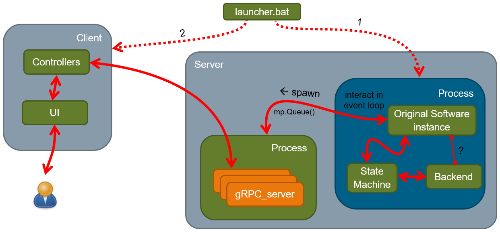

gRPC based API for some Software
================================

gRPC based API for some software.

gRPC uses HTTP/2 as a transfer and Protocol Buffers for data serialisation (Interface Definition Language)

Description
-----------

The API of the original software ```./calculator.py``` is defined and documented 
in ```.proto``` files in ```./api/proto```. These ```.proto``` files are compiled by 
```protoc``` compiler into stubs for specified languages (see ```./api/bin/compile_all_protos.bat```). 
```protoc``` also compiles Swagger file for the interactive web documentation (see ```./grpc_client_web```).

    ```.``` - folder with original software ```./calculator.py```
    ```api``` - folder with all gRPC stuff
        ```bin``` - run gRPC server and an original software
        ```proto``` - API definitions in .proto files
        ```grpc_server_python``` - gRPC Python server
        ```grpc_client_cpp``` - gRPC C++ client. See the README in that folder
        ```grpc_client_python``` - gRPC Python client. See the README in that folder
        ```grpc_client_web``` - gRPC RESTfull HTTP proxy server + Swagger interactive autodoc. See the README in that folder
    ```doc``` - working documents (not the documentation of the API)

All common environment variables are located in ```./api/env_vars_common.txt```

Architecture: original software + gRPC server
---------------------------------------------



Prerequisites
-------------

    python 3.8.8
    
    grpcio                      1.44.0
    grpcio-tools                1.44.0
    protobuf                    3.19.4
    googleapis-common-protos    1.56.0

    Check prerequisites in ```./api/grpc_client_cpp```
    Check prerequisites in ```./api/grpc_client_web```

Quick start
-----------

1. Install all prerequisites
2. Clone this repo
3. Run ```./api/bin/compile_all_protos.bat```. All .proto files in ```./api/proto``` will be compiled in apropriate disr (```./api/grpc_client_python/proto_compiled```, ```./api/grpc_client_python/proto_compiled``` etc.)
4. Launch the original software with the server: ```./api/bin/run_software_with_python_server.bat```
5. You will see the output in CLI and a log file for the server here: ```%USERPROFILE%\.grpc_server_NAME_python\grpc_server.log```. Format: ```'%(asctime)s|%(process)d|%(thread)d|: %(message)s'```
6. In a separate CLI run the client, for example ```./api/grpc_client_python/bin/run_python_client.bat```
7. You will see the output in CLI and a log file for the client here: ```%USERPROFILE%\.grpc_cleint_NAME_python\grpc_client_python.log```. Also you will see effects in server CLI
8. Follow README in ```./api/grpc_client_cpp``` for gRPC client in C++
9. Follow README in ```./api/grpc_client_web``` for gRPC RESTfull HTTP proxy server + Swagger interactive autodoc
10. Test Streaming Python client: In a separate CLI run ```./api/grpc_client_python/bin/run_python_client_streaming_start.bat```
11. Test Streaming REST client (```curl```): In a separate CLI run ```./api/grpc_client_web/bin/curl_client_stream.bat```
12. To interrupt streaming: from another client (e.g. Swagger web page, check README in ```./api/grpc_client_web```) run ```StopLongProcessStreaming```. You have to run it two times as you run two streaming clients above.

TODO:
-----

- More smart logging. 
- Setup SSL in gRPC Python server
- Server streaming: If client just closed - server still stream. How to fix? Always use bidirectional streaming?
- Streaming. Several clients send the same request: manage queue based on client id. 
Because there might be several streaming process running (several clients sent the same request). 
There might be launched several streaming clients. When you sent signal by this Queue to stop the signal, 
it can be received by ANY of running process! You have to stop process based on Client id
- Parallel/asynchronous access client-server
- is it possible to use GET and POST for the same rpc method?
- compile googleapis-common-protos (see prerequisites) from https://github.com/googleapis/googleapis.git


googleapis
----------

The project assume that we are using HTTP transcoding for communication by REST with gRPC. https://cloud.google.com/endpoints/docs/grpc/transcoding

For this reason you have to install some extensions https://github.com/googleapis/googleapis (I used https://github.com/googleapis/googleapis/tree/004b289eebc86f663d4f9b3aec9a9bc6df49dd8d)

    git clone https://github.com/googleapis/googleapis.git  # # https://github.com/googleapis/googleapis/tree/740f0727337b87ea29fd56802f0ba999bfbf15b5
    set GOOGLEAPIS_DIR=<path to this folder>\googleapis

Then edit ```GOOGLEAPIS_DIR``` in ```./api/bin/compile_all_protos.bat``` or ```./api/env_vars_common.txt```. 

> **NOTE**
>   
>   You will need only tree files (already in .bat file):
>   
>       %GOOGLEAPIS_DIR%\google\api\annotations.proto 
>       %GOOGLEAPIS_DIR%\google\api\http.proto 
>       %GOOGLEAPIS_DIR%\google\rpc\status.proto
>   
>   After compiling you will see automatically generated source files for certain language in ```proto_compiled``` folders in appropriate client or server.

Build .proto with protoc
------------------------

Do not edit manually anything in any of ```proto_compiled``` folders. These files are generated automatically by calling ```./api/bin/compile_all_protos.bat```

protoc VS buf
-------------

```buf``` uses [Remote Plugin Execution](https://docs.buf.build/bsr/remote-generation/remote-plugin-execution) which means 
it goes to the central place (in the internet OR maybe it is possible to have on-premise repo) of plugins and uses them.

For ```protoc``` and ```grpc``` you have to build it from source or find binaries. 
Which means that if you want to create a client for different languages/platforms you have to install ```protoc```, ```grpc```, ```grpc-gateway``` environment to build ```.proto``` files.

At the time of development of this 'project' I can not recommend use ```buf``` because it is an additional dependency in the project. 
There are some other doubts about the project.

https://www.reddit.com/r/golang/comments/dknv9b/buf_a_new_way_of_working_with_protocol_buffers/